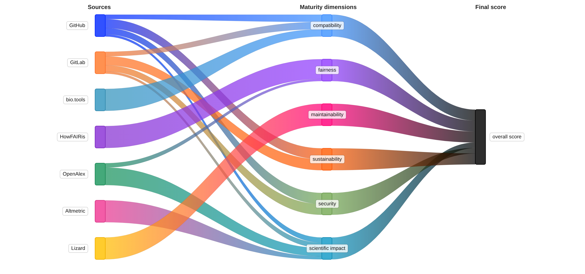

# Multi-Modal Maturity Model

This Multi-Modal Maturity Model (M4) for research software and services is being developed for Work Package 1 of the [TDCC-LSH](https://tdcc.nl) project ["A FAIR tool framework for bioinformatics services, tools and workflows in digital Life Sciences and Health (LSH) research"](https://tdcc.nl/projects/tdcc-lsh-project-initiatives/). The purpose of the model defined and computed by M4 is to provide a quantitative measure of maturity for research software and related services, aggregated along a number of modalities, dimensions or categories, balancing sensitivity to increamental improvements and general robustness.

The maturity model is truly multi-modal in that it combines several orthogonal approaches:

- **Bibliometrics** — quantitative metrics like citation counts to measure scientific impact
- **Static code analysis** — code quality, maintainability and security
- **Software metadata** — FAIRness and sustainability
- **Manual evaluation** — user communities, project governance and scientific uniqueness




## Installation

Requires Python 3.12+.

```bash
pip install git+https://github.com/fair-toolbox/multi-modal-maturity-model.git
```

This installs the `mmmm` command-line tool and the `mmmm` Python package.

## Usage

CLI:

```bash
# Analyze a repository with default weights
mmmm analyze https://github.com/user/repo -o results.json

# Use a custom weights file and optional identifiers
mmmm analyze https://github.com/user/repo \
  --weights my-weights.yaml \
  --biotools my-tool \
  --doi 10.1000/example1 \
  --doi 10.1020/example2 \
  --output results.json

# Analyze a local checkout (skip cloning)
mmmm analyze https://github.com/user/repo --local-repo-path ./repo
```

## Configuration

API tokens are read from the environment or a `.env` file:

```dotenv
GITHUB_TOKEN=ghp_...
GITLAB_TOKEN=glpat-...
ALTMETRIC_TOKEN=...
```

Metric weights and scoring can be customized with a YAML file; see the [configuration documentation](https://fair-toolbox.github.io/multi-modal-maturity-model/configuration/) for details.

## Documentation

Full documentation is available at [fair-toolbox.github.io/multi-modal-maturity-model](https://fair-toolbox.github.io/multi-modal-maturity-model), including:

- [User guide](https://fair-toolbox.github.io/multi-modal-maturity-model/user_guide/)
- [Dimensions and metrics](https://fair-toolbox.github.io/multi-modal-maturity-model/maturity_model/)
- [Configuration](https://fair-toolbox.github.io/multi-modal-maturity-model/configuration/)

## Development

```bash
git clone https://github.com/fair-toolbox/multi-modal-maturity-model.git
cd multi-modal-maturity-model
pip install -e . --group dev
pytest
```

To build and serve the documentation locally:

```bash
pip install -r docs/requirements.txt
mkdocs serve
```

See [Contributing](https://fair-toolbox.github.io/multi-modal-maturity-model/contributing/) for guidelines.

## License

MIT — see [LICENSE](LICENSE).
